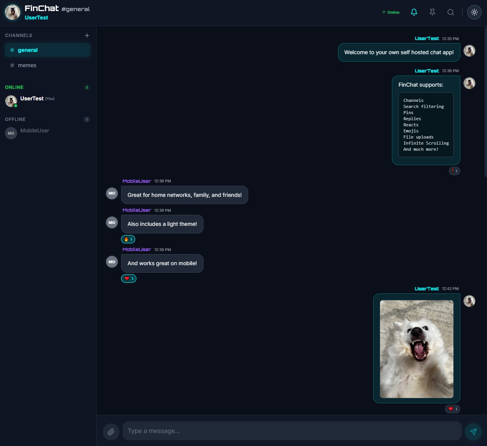
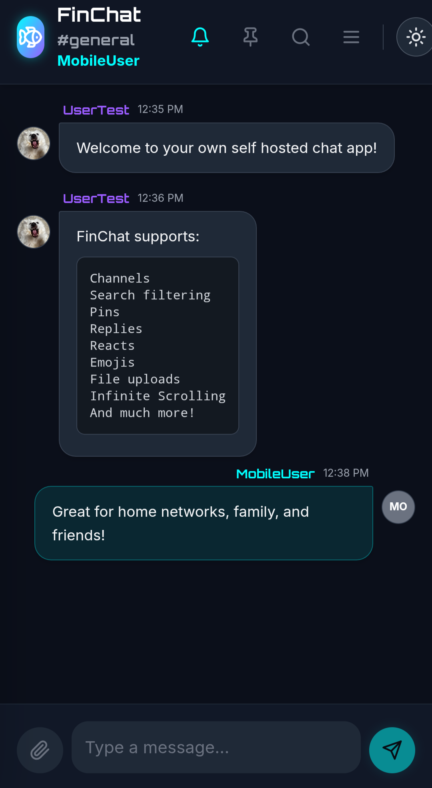
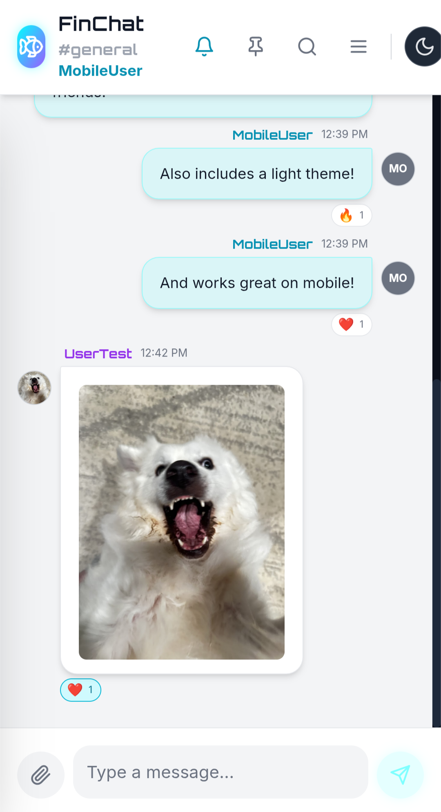
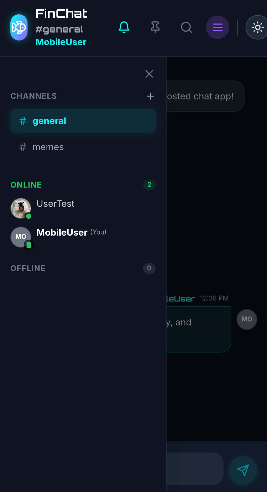
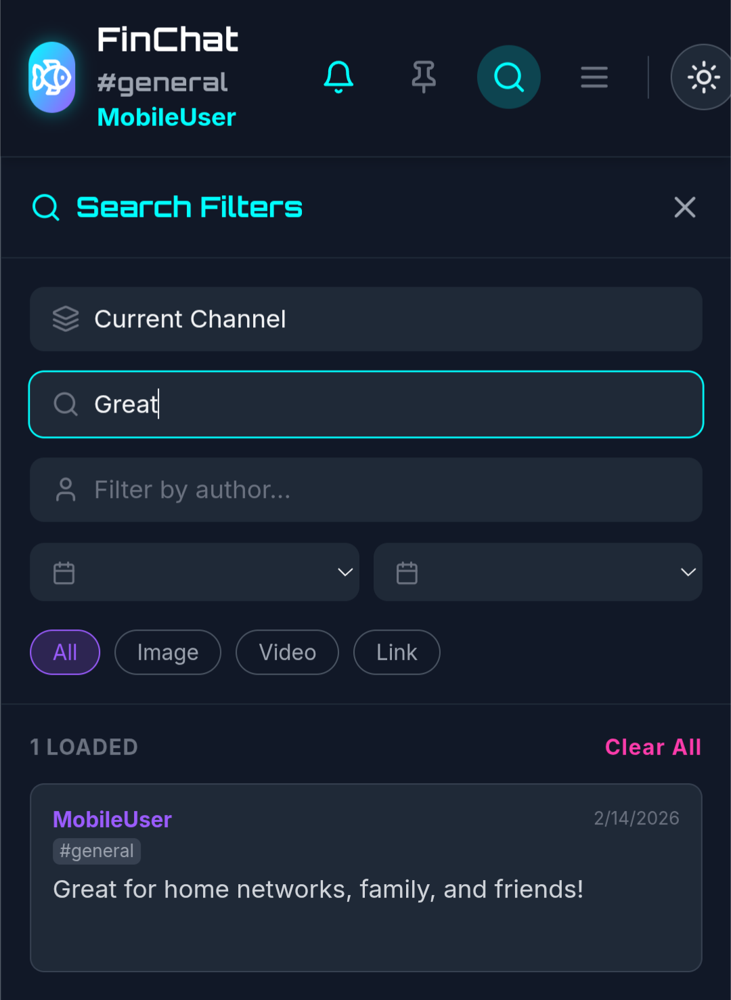

# Screenshots

<p align="center">
  
</p>

<p align="center">
  
  
  
  
</p>


# Setup

To test on localhost checkout the `localhost` branch.

When ready to host on your own secure web server checkout the `main` branch.

**Prerequisites:** 
- Node.js
- npm

1. Install dependencies:
   `npm install`
2. Run node server
   `node server/index.js`
3. Run the app:
   `npm run dev`

If testing locally navigate to http://localhost:3000/ to start using the app on your home network.

# Web Server Setup

**Prerequisites:** 
- Domain Name with an A record pointing to your server's public IP address.
- TCP ports 80 and 443 opened on your firewall or router.

First download a web server. I used [NGINX](https://nginx.org/).

In this example NGINX will act as a reverse proxy for the app and server running on your localhost.

Navigate to where you installed NGINX and open the `conf/nginx.conf` file.

Add the following port 80 server block.

```
server {
	listen 80;
	server_name myapp.mydomain.com www.myapp.mydomai.com; # replace with your domain

	# ACME challenge for Certbot
	location /.well-known/acme-challenge/ {
		root path/to/nginx/ # replace with the path to your nginx installation
		allow all;
	}

	# Redirect all other traffic to HTTPS
	location / {
		return 301 https://$host$request_uri;
	}
}
```

Start your nginx server by navigating to the install folder and running `start nginx` with administrator privileges.

As you make changes to your nginx.conf you can use `nginx -s reload` to reload the config instantly.

## SSL Certificates

**Prerequisites:**
- Python
- pip

The following steps will walk you through how to generate free signed certificates on Windows using Python and certbot.

**Step 1**:
Use certbot to generate a certificate. You'll need to setup a python venv and install certbot:
```
python -m venv certbot-env
source certbot-env/Scripts/activate
pip install certbot
python -m pip install --upgrade pip setuptools wheel
pip --version
pip install certbot
```

**Step 2**:
On powershell as admin execute the following:
```
Set-ExecutionPolicy -ExecutionPolicy RemoteSigned -Scope CurrentUser
./certbot-env/Scripts/Activate.ps1
```

Before executing the next command ensure your nginx.conf is set to serve the cert challenge files and you've started your nginx server.
```
certbot.exe certonly --webroot -w path/to/nginx -d myapp.mydomain.com
```

Certificates will be generated like so:
```
Certificate is saved at: C:\Certbot\live\myapp.mydomain.com\fullchain.pem
Key is saved at:         C:\Certbot\live\myapp.mydomaincom\privkey.pem
This certificate expires on YYYY-MM-DD.
```

Once the cert has been generated you can optionally remove the ACME challenge location block from your port 80 server block.

**Step 3**:
Add a new server block listening on 443
```
    server {
        listen 443 ssl;
        server_name myapp.mydomain.com www.myapp.mydomain.com; # replace with your domain

        ssl_certificate     "C:/Certbot/live/myapp.mydomain.com/fullchain.pem"; # replace with your path
        ssl_certificate_key "C:/Certbot/live/myapp.mydomain.com/privkey.pem";   # replace with your path

        ssl_protocols TLSv1.2 TLSv1.3;
        ssl_prefer_server_ciphers on;

        # IP WHITELIST (STRONGLY RECOMMENDED ONCE SETUP IS COMPLETE)
        #allow XXX.XXX.XXX.X;   # replace with your IP
		#allow XXX.XXX.XXX.X;   # add additional whitelisting as needed
        #deny all;

        # FRONTEND CHAT APP (port 3000)
        location / {
            proxy_pass http://127.0.0.1:3000;
            proxy_http_version 1.1;

            # WebSocket support
            proxy_set_header Upgrade $http_upgrade;
            proxy_set_header Connection "upgrade";

            proxy_set_header Host $host;
            proxy_set_header X-Real-IP $remote_addr;
            proxy_set_header X-Forwarded-For $proxy_add_x_forwarded_for;
			proxy_set_header X-Forwarded-Proto $scheme;
        }

        # BACKEND WEBSOCKETS (port 4000)
        location /ws/ {
            proxy_pass http://127.0.0.1:4000/;
            proxy_http_version 1.1;

            proxy_set_header Upgrade $http_upgrade;
            proxy_set_header Connection "upgrade";

            proxy_set_header Host $host;
            proxy_set_header X-Real-IP $remote_addr;
            proxy_set_header X-Forwarded-For $proxy_add_x_forwarded_for;
			proxy_set_header X-Forwarded-Proto $scheme;
        }
		
		# BACKEND API AND UPLOADS (port 4000)
		location /api/ {
            proxy_pass http://127.0.0.1:4000/;
            proxy_http_version 1.1;

            proxy_set_header Upgrade $http_upgrade;
            proxy_set_header Connection "upgrade";

            proxy_set_header Host $host;
            proxy_set_header X-Real-IP $remote_addr;
            proxy_set_header X-Forwarded-For $proxy_add_x_forwarded_for;
			proxy_set_header X-Forwarded-Proto $scheme;
        }

        location /uploads/ {
            alias path/to/finchat/data/media/; # replace with your path
            autoindex off;

            # Optional caching
            expires 7d;
        }

        # ERROR PAGES
        error_page   500 502 503 504  /50x.html;
        location = /50x.html {
            root   html;
        }
    }
```

## Test
Reload your nginx server `nginx -s reload`

Ensure you're on the main branch and restart the node server and app
`node server/index.js`
`npm run dev`

Try out your secure self hosted chat app via `https://myapp.mydomain.com`

All messages, users, and media files will be saved on your server at `path/to/finchat/data/`


## Disclaimer
This application was created with the assistance of [Google AI Studio](https://aistudio.google.com/). The developer makes no guarantees regarding reliability for any particular purpose and assumes no responsibility for any outcomes resulting from its use.
